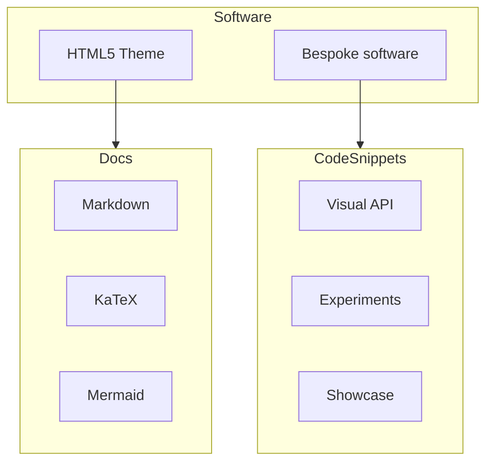
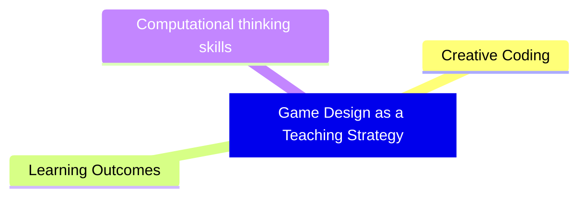

---
# try also 'default' to start simple
theme: seriph
# new background image
# background: https://raw.githubusercontent.com/visualcomputing/p5.treegl/main/p5.treegl.png
background: "/fig/p5.quadrille.js.png"
# apply any unocss classes to the current slide
class: 'text-center'
# https://sli.dev/custom/highlighters.html
highlighter: shiki
# some information about the slides, markdown enabled
info: |
  ## Edu-software research
  Using advanced rendering techniques

  More info at our [blog](https://jpcharalambosh.co)
transition: slide-left
title: Research
mdc: true
hideInToc: true
---

# Game-Based Learning Research
  
[Jean Pierre Charalambos](mailto:jpcharalambosh@unal.edu.co)

[Universidad Nacional de Colombia, sede Bogotá](https://unal.edu.co/)

<!-- 
* thanks invitation
* talk focus research and collab
* sort() algorithm
 -->

---
layout: center
hideInToc: true
---

# Table of contents

<Toc maxDepth="1"></Toc>

---
layout: center
---

# p5.tree + Slidev

  <TreeSketch />

  Presiona <b>A</b> para guardar frames y <b>P</b> para reproducir el camino de cámara.

---
layout: center
---

# Portal Rendering (Non-Euclidean)
Use FBOs & p5.tree to project worlds within cube

<ShaderCube />

---
level: 2
---

# OOP eBook architecture

> Bespoke software → [p5.tree](https://www.npmjs.com/package/p5.tree)
> * Inspired by Conways [p5.treegl](github.com/VisualComputing/p5.treegl/) concept
> * Creative coding, game-based learning  rich theoretical framework
> * Self-maintain

---
layout: center
level: 2
transition: fade-out
---

# Serious games

Serious games combine play with purpose, using game mechanics to engage players in learning essential skills and concepts across various disciplines while transforming education into an interactive, enjoyable experience

- [Foldit](https://fold.it): Protein folding puzzle game contributing to real scientific research
- [SPENT](http://playspent.org/): Simulation of the challenges of living in poverty, focusing on financial decision-making
- [Minecraft: Education Edition](https://education.minecraft.net/): Game-based learning platform for teaching various subjects through creative problem-solving
- [LEGO Education SPIKE Prime](https://education.lego.com/en-us/products/lego-education-spike-prime-set/45678): Hands-on STEM learning tool combining LEGO building with robotics and programming

<!-- 
game mechanics -> engage in learning
 -->

---
transition: fade-out
title: Research problem
---

# 3. Research problem

  <strong>Hypothesis:</strong> The p5.quadrille.js library, along with the p5.js API, enables students to engage in key computational thinking skills through grid-based game design as an effective teaching strategy

---
layout: center
level: 2
transition: fade-out
---

# Creative coding

Creative coding refers to the practice of writing computer programs primarily for creative expression rather than functional or purely technical purposes

## Apps

Art, visualizations, interactive installations, games, and other forms of digital media

## Audience

Artists, designers & educators

---
layout: center
title: Contribute
transition: fade-out
---

# 5. Contribute

* Collaboration
* Play, design & learn
* Research

---
layout: center
level: 2
---

# Research

* Sustainability: Integrating environmentally responsible, socially equitable, and economically viable practices into GBL
* Serious-Games: Conceptualization, design & implementation
* Algorithm visualization, e.g., [image convolution](https://jpcharalambosh.co/posts/image_convolution_visualizer/) and interactive techniques for implementing [chess rules](https://objetos.github.io/chess-thesis-website/)

<!-- 
Idea is to use lib in mentorship: prof ocasionales & assistants
 -->
