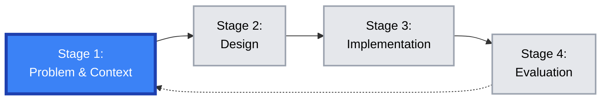

---
# try also 'default' to start simple
theme: seriph
# new background image
# background: https://raw.githubusercontent.com/visualcomputing/p5.treegl/main/p5.treegl.png
background: "p5.tree.png"
# apply any unocss classes to the current slide
class: 'text-center'
# https://sli.dev/custom/highlighters.html
highlighter: shiki
# some information about the slides, markdown enabled
info: |
  ## Edu-software research
  Using advanced rendering techniques

  More info at our [blog](https://jpcharalambosh.co)
transition: slide-left
title: Research
mdc: true
hideInToc: true
---

# Stage 1: Context & Problem Definition
**ABJ-d: Game-Based Learning Design**

[Jean Pierre Charalambos](mailto:jpcharalambosh@unal.edu.co)

[Universidad Nacional de Colombia, sede Bogotá](https://unal.edu.co/)

---
layout: center
hideInToc: true
---

# Table of contents

<Toc maxDepth="1"></Toc>

---
level: 1
---

# The Four-Stage Design Cycle

**Current Focus: Stage 1** - Establish the *why* and *what*.

**Goal:** Build a rigorous foundation for your GBL project.

---
level: 1
---

# State of the Art Review

**Start with the highest level of evidence: Systematic Reviews (SR).**

**Your task:** Find the **Systematic Review** most relevant to your chosen domain. Use the course list as a starting point.

**Why Systematic Reviews?**
- They use **explicit, reproducible methods** to minimize bias.
- They aim to find and synthesize **all available evidence** on a focused domain.
- They identify **consensus, gaps, and effective interventions**.
- They represent the **"gold standard"** for synthesizing research evidence.

---
level: 2
---

# Key Reviews: General Higher Education

**Use these as methodological guides. Focus on Q1/Q2 journals.**

- **Chernikova et al. (2020):** *Simulation-Based Learning in Higher Education: A Meta-Analysis*.  
  *Review of Educational Research*.  
  [DOI: 10.3102/0034654320933544](https://doi.org/10.3102/0034654320933544)

- **Khoo et al. (2025):** *The Impacts of Game-based Learning on Thinking and Learning in Higher Education Context: A Scoping Review*.  
  *International Journal of Education in Mathematics, Science and Technology (IJEMST)*.  
  [PDF](https://files.eric.ed.gov/fulltext/EJ1475747.pdf) | [DOI: 10.46328/ijemst.4776](https://doi.org/10.46328/ijemst.4776)

- **Lester et al. (2023):** *Drivers and Barriers to the Utilisation of Gamification and Game-Based Learning in Universities*.  
  *British Journal of Educational Technology*.  
  [DOI: 10.1111/bjet.13311](https://doi.org/10.1111/bjet.13311)

**These reviews provide broad insights into GBL effectiveness, implementation challenges, and methodological approaches across higher education contexts.**

---
level: 2
---

# Key Reviews: STEM & Technical Domains

**Domain-specific systematic reviews to guide your literature search.**

- **Computer Science Education:**  
  **Videnovik et al. (2023):** *Game‐based learning in computer science education: a scoping literature review*.  
  *International Journal of STEM Education*.  
  [DOI: 10.1186/s40594-023-00447-2](https://doi.org/10.1186/s40594-023-00447-2)

- **Programming/Computational Thinking:**  
  **Yusof et al. (2025):** *Exploring Game Based Learning: A Systematic Literature Review (2021-2025)*.  
  *International Journal of Multimedia & Its Applications (IJMA)*.  
  [PDF](https://aircconline.com/ijma/V17N5/17525ijma01.pdf)

- **Learning Analytics in GBL:**  
  **Alonso-Fernández et al. (2023):** *Learning analytics for online game-Based learning: a systematic review*.  
  *Behaviour & Information Technology*.  
  [DOI: 10.1080/0144929X.2023.2255301](https://doi.org/10.1080/0144929X.2023.2255301)

---
level: 2
---

# Key Reviews: Health & Other Domains

**Continuing with domain-specific systematic reviews.**

- **Medical Education:**  
  **Gorbanev et al. (2018):** *A Systematic Review of Serious Games in Medical Education: Quality of Evidence and Pedagogical Strategy*.  
  *Medical Education Online*.  
  [PMID: 29457760](https://pubmed.ncbi.nlm.nih.gov/29457760/)

- **Dental Education:**  
  **Mohandas & Mohapatra (2025):** *All Work and No Play Makes Jack a Dull Boy – A Systematic Review on Effectiveness of GBL in Dental Education*.  
  *Digital Education Review*.  
  [PDF](https://files.eric.ed.gov/fulltext/EJ1465303.pdf)

**If no systematic review exists for your specific domain, build your foundation from recent primary studies published in Q1/Q2 journals.**

---
level: 1
---

# Define Your Project Core

**Deliverable (25%): A Research & Analysis Dossier.**

**Your dossier must answer:**
1.  **What is the educational problem?** (Domain & Problem Selection)
2.  **What does the literature say?** (Analysis of Systematic Reviews)
3.  **How can GBL address the gap?** (Tentative Problem Definition)

**Synthesis Methods:** Use [Concept Maps](https://en.wikipedia.org/wiki/Concept_map) or [Mermaid Mindmaps](https://mermaid.js.org/syntax/mindmap.html) to structure your findings.

---
level: 1
---

# Deliverable Checklist

**Your Research & Analysis Dossier should contain:**
- [ ] **Introduction**
- [ ] **State-of-the-Art Review** (with citations & links)
- [ ] **Gap & Problem Analysis** (use a synthesis method)
- [ ] **Tentative Problem Definition**
- [ ] **References**
